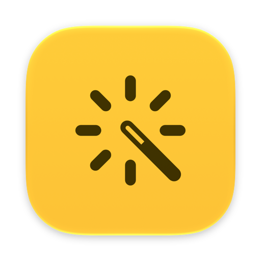
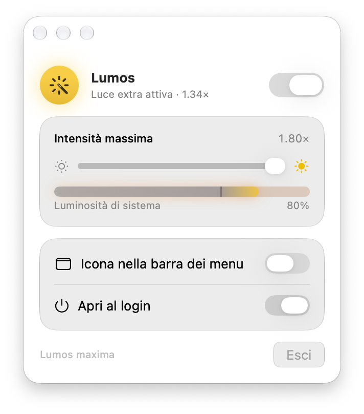

<p align="center">
  
</p>

<h1 align="center">Lumos</h1>

<p align="center">
  Push your MacBook Pro's XDR display past its normal SDR brightness limit — everywhere, not just in HDR videos.
</p>

<p align="center">
  
</p>

## What it does

MacBook Pro mini-LED (Liquid Retina XDR) displays can reach 1000+ nits, but macOS caps normal
desktop content at about 500 nits and keeps the rest for HDR video. Lumos unlocks that extra
headroom for the whole screen.

- **Extends the system brightness range**: Lumos follows the normal brightness keys and slider. Above 65% it starts adding extra light, reaching your chosen maximum (up to 1.8×) at 100%.
- **Highlight protection**: shadows and midtones get the full boost while whites are compressed smoothly, so bright areas keep their detail instead of burning out.
- **Smooth transitions**: changes ease in over ~0.3 s, in sync with macOS's own brightness animation.
- **Light on resources**: when idle it uses almost no CPU, because macOS tells it when brightness changes instead of Lumos polling. It turns the extra light off completely when it isn't boosting, to save battery.
- Menu bar icon (can be hidden: open Lumos from Applications/Spotlight to show its window) and an optional login item.

## Requirements

- A Mac with an XDR / HDR display (MacBook Pro 14"/16" M1 Pro or later, Pro Display XDR)
- macOS 26 or later, Apple Silicon

## Install

1. Download the latest `Lumos-x.y.z.dmg` from [Releases](https://github.com/rombri02/lumos/releases).
2. Open it and drag **Lumos** to **Applications**.
3. Lumos is not signed with an Apple Developer ID yet, so the first time macOS will block it:
   open Lumos, then go to **System Settings → Privacy & Security** and click **Open Anyway**.

   Or from Terminal:
   ```sh
   xattr -dr com.apple.quarantine /Applications/Lumos.app
   ```

## How it works

1. A 1×1-pixel window shows HDR content, which tells macOS to enable EDR (Extended Dynamic Range):
   the backlight goes up and headroom opens above SDR white.
2. Lumos then scales the display's gamma table into that headroom with a tone curve that
   protects highlights. The boost never exceeds the headroom macOS grants at that moment, so
   thermal and power limits stay in macOS's control.

System brightness is read through `DisplayServices`, a private macOS framework (there is no
public API). It has been stable for years, but a future macOS update could break it. This is
also why Lumos can't be on the Mac App Store.

## Is it safe for the display?

Lumos stays within what the panel is designed to sustain (~1000 nits full screen in HDR) and
macOS still dims the panel by itself if it gets too hot. Mini-LED has no burn-in. Expect higher
battery use and heat at high boost levels.

## Build from source

Requires Xcode 26+.

```sh
./build.sh            # → build/Lumos.app
./build.sh --install  # build and move to /Applications
./make-dmg.sh         # → build/Lumos-1.0.0.dmg   (VERSION=1.2.0 ./make-dmg.sh)
build/Lumos.app/Contents/MacOS/Lumos --selftest   # tone curve / easing checks
```

Releases are built by GitHub Actions: push a tag like `v1.0.0` and the DMG is attached to the
release automatically.

## License

[MIT](LICENSE)
